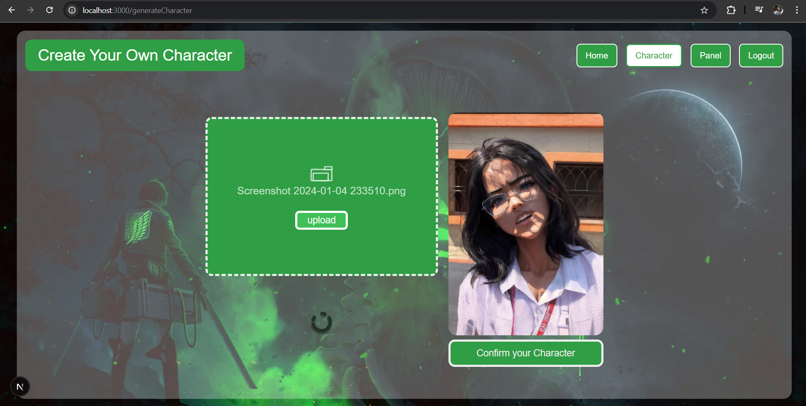

# 🖼️ MangaKai – AI Manga Panel Generator

**Turn your imagination into manga.**  
MangaKai lets you write a short story, and it generates a cinematic manga panel using OpenAI + ComfyUI + Stable Diffusion which you can use to create your own manga.


> ✨ Built with: Django, Next.js, Tailwind CSS, ComfyUI, and OpenAI GPT

---
  
  


---

## 🚀 Features

- 🧠 **Natural Language → Manga Panel**: Converts user-submitted stories into cinematic panel prompts using GPT.
- 🎨 **Character Generator**: Converts selfies into anime-style characters using ComfyUI.
- 🖼️ **Dynamic Workflows**: Auto-selects 1-character, 2-character, or group scene workflows based on GPT-parsed structure.
- 🧰 **Full-stack Integration**: Built with Django REST API, ComfyUI backend, and a beautiful frontend in Next.js + Tailwind CSS.
- 💬 **Text Bubble Support**: Automatically generates and overlays narration and dialogue on panels.

---

## 🌐 Tech Stack

| Frontend        | Backend         | AI/ML           | Infra |
|-----------------|------------------|------------------|--------|
| Next.js, Tailwind CSS | Django, DRF, Token Auth | OpenAI GPT-3.5, ComfyUI, Stable Diffusion | WebSocket, Python, dotenv |

---


## 🛠️ How It Works

```mermaid
flowchart TD
  A[User writes a manga panel story] --> B[GPT parses it into prompt JSON]
  B --> C{Workflow Decision}
  C -->|1 Character| D1[run_panel_workflow1.py]
  C -->|2 Characters| D2[run_panel_workflow2.py]
  C -->|Crowd/Group| D3[run_group_workflow.py]
  D1 & D2 & D3 --> E[ComfyUI: image generation]
  E --> F[Django saves panel + adds text bubble]
  F --> G[Panel appears in UI]


## 🧪 Run Locally

<details>
<summary>📦 Backend (Django + ComfyUI)</summary>

```bash
# Clone the repository
git clone https://github.com/yourusername/mangakai.git
cd mangakai_backend/mangakai

# Create virtual environment and install dependencies
python -m venv venv
source venv/bin/activate  # or venv\Scripts\activate on Windows
pip install -r requirements.txt

# Add your OpenAI API key to .env
# Example .env file:
# API_KEY=sk-...

# Run database migrations
python manage.py migrate

# Start the Django server
python manage.py runserver

# run ComfyUI 
cd mangakai_backend/confyUI/ComfyUI
python -m venv venv
source venv/bin/activate  # or venv\Scripts\activate on Windows
python main.py --listen 

</details> <details> <summary>💻 Frontend (Next.js + Tailwind CSS)</summary>

```bash
cd mangakai

# Install dependencies
npm install

# Run the development server
npm run dev


---
## 🧠 Prompt Engine

A story like:

> *"A teenage boy stands defiant as a demon army charges behind him. He says, 'I won't run anymore.'"*

Is parsed into this by GPT:

```json
{
  "prompt": "teenage boy standing firm as demon army charges from behind, cinematic, intense atmosphere, manga panel, black and white",
  "characters": [],
  "text_bubbles": [
    { "type": "narration", "text": "The time for running was over." },
    { "type": "dialogue", "speaker": "Teenage Boy", "text": "I won't run anymore." }
  ]
}
